관통 프로젝트 제출 방법

# 관통프로젝트: 
### 프로젝트이름 : EnjoyTripSpring
### 제출일: 2023.11.03일 23시 59분

### 참여 페어
- 신문영(조장), 구본승

### 처리된 요구사항 목록
  
|난이도|구현기능|세부|작성여부(O/X)|
|:---:|---|---|:---:|
|기본|메인페이지||O|
|기본|회원관리|회원정보 등록|O|
|기본|회원관리|회원정보 수정|X|
|기본|회원관리|회원정보 삭제|O|
|기본|회원관리|회원정보 검색|X|
|기본|로그인/로그아웃||O|
|기본|관광지 정보 관리|전체검색|O|
|기본|관광지 정보 관리|상세 조회|O|
|기본|관광지 정보 관리|지역별 조회|O|
|기본|관광지 정보 관리|관광지 종류별 조회|O|
|추가|현재 위치에서 가까운 순으로 관광지 조회||O|
|심화|게시판(여행정보 공유) 관리||O|

* 작성된 기능은 반드시 캡쳐되어야 합니다. 
* 추가로 구현한 기능을 표에 추가시키세요.

### 실행화면 캡쳐 - 
TODO: 요구사항 목록에서 완료 처리된 기능을 Swagger로 테스트한 결과를 캡쳐하여 이미지를 등록하세요.

구현 기능: BackEnd(SpringMVC(RestController), Model(Dao, Service, Dto))

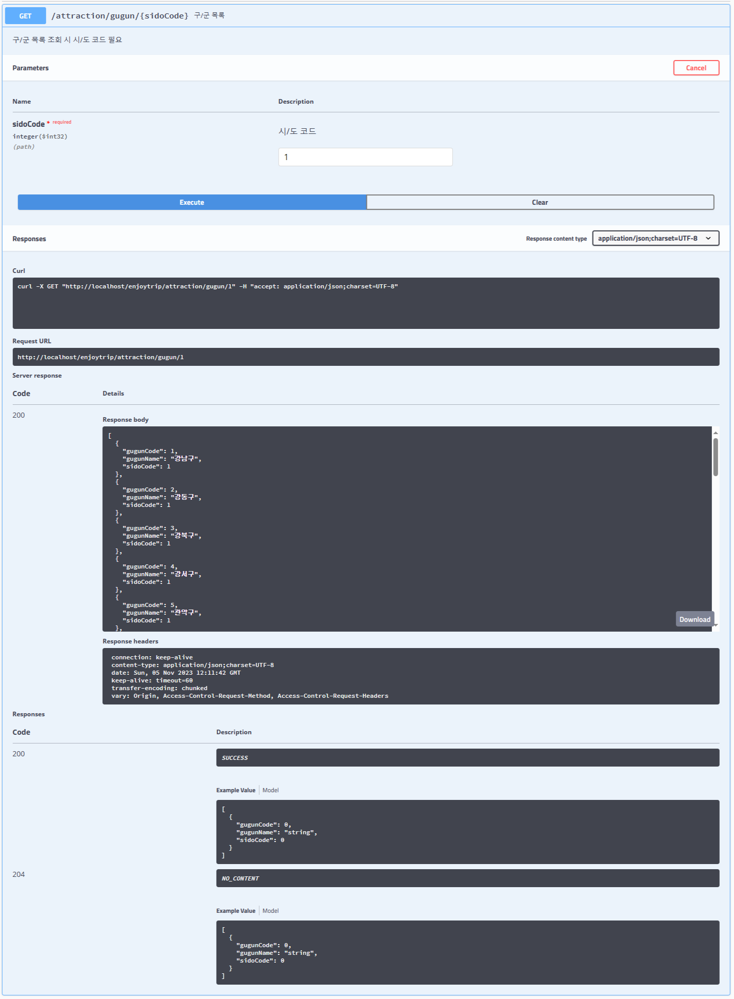
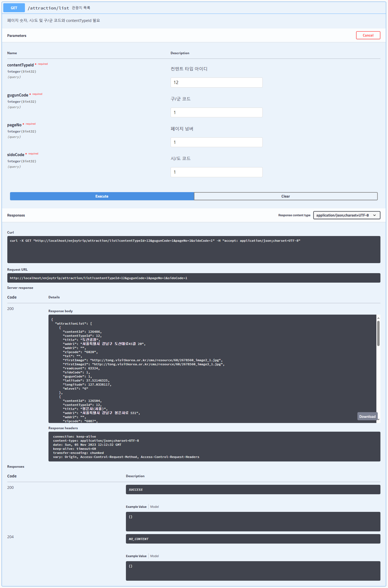
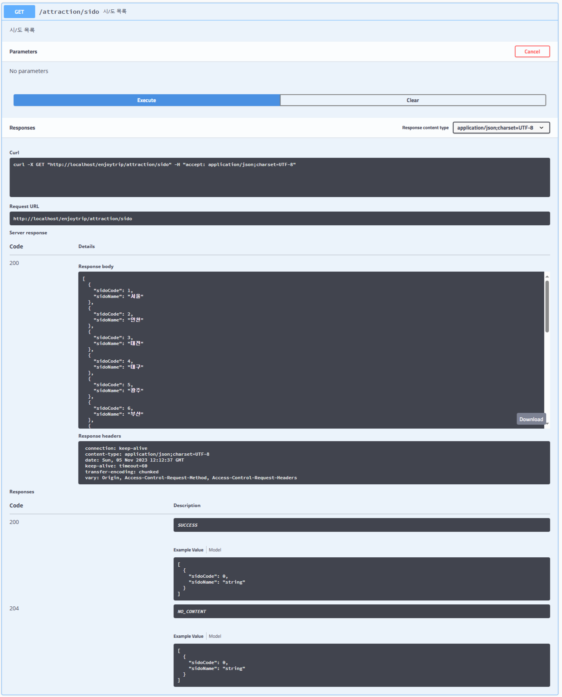
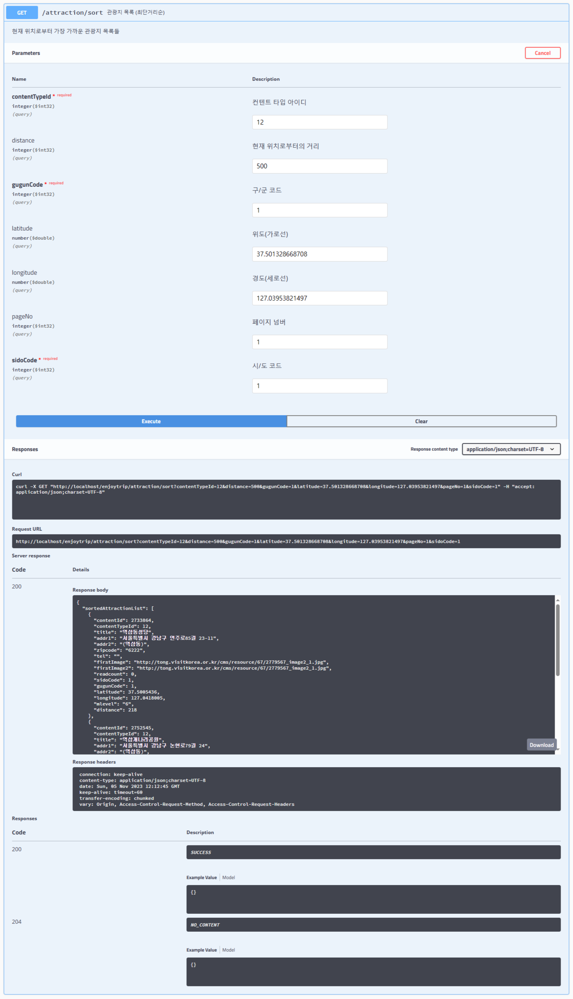

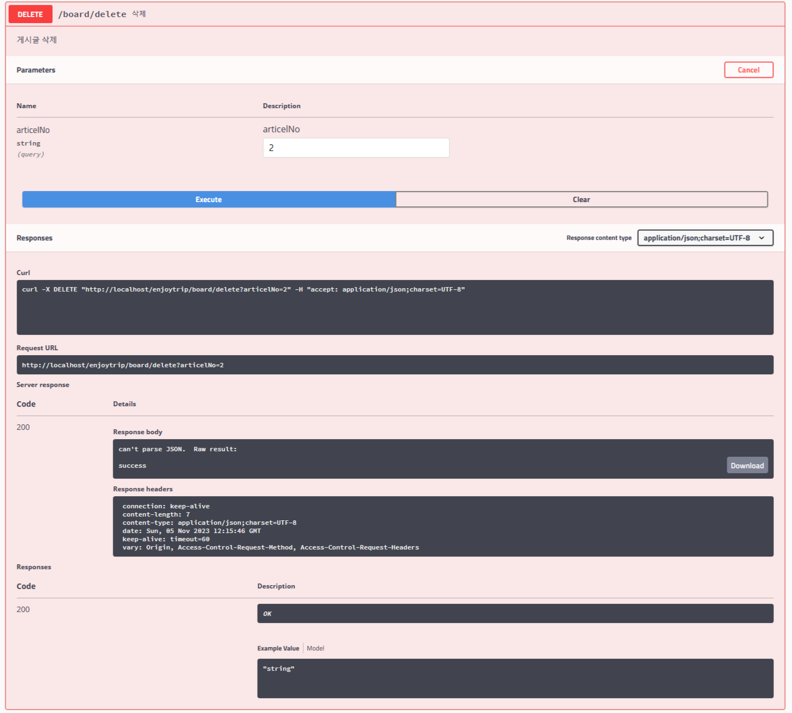
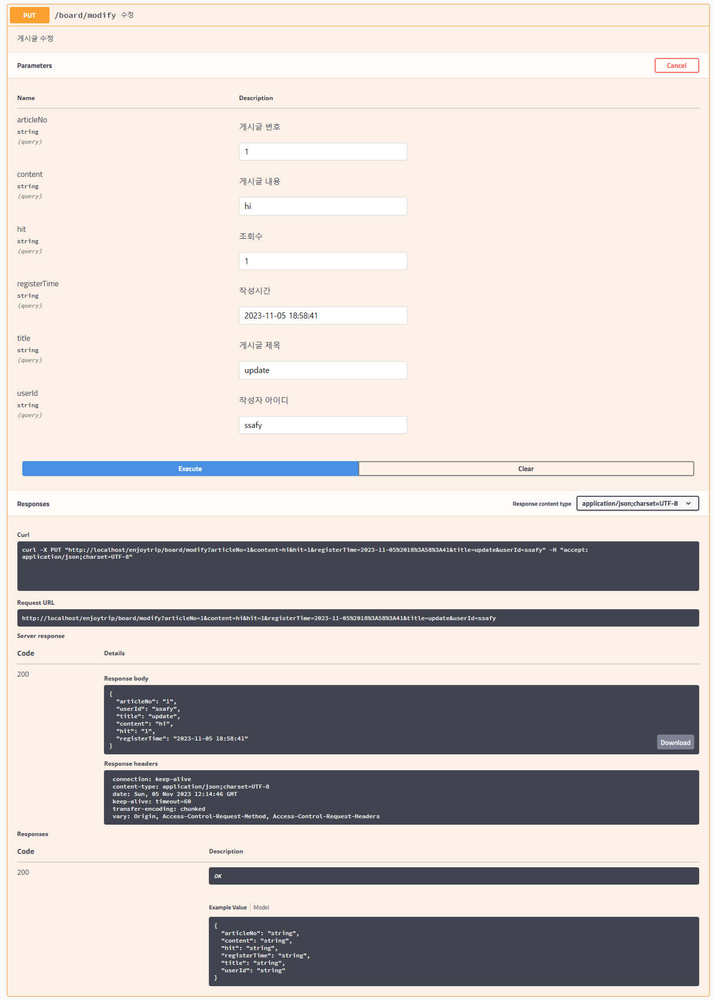
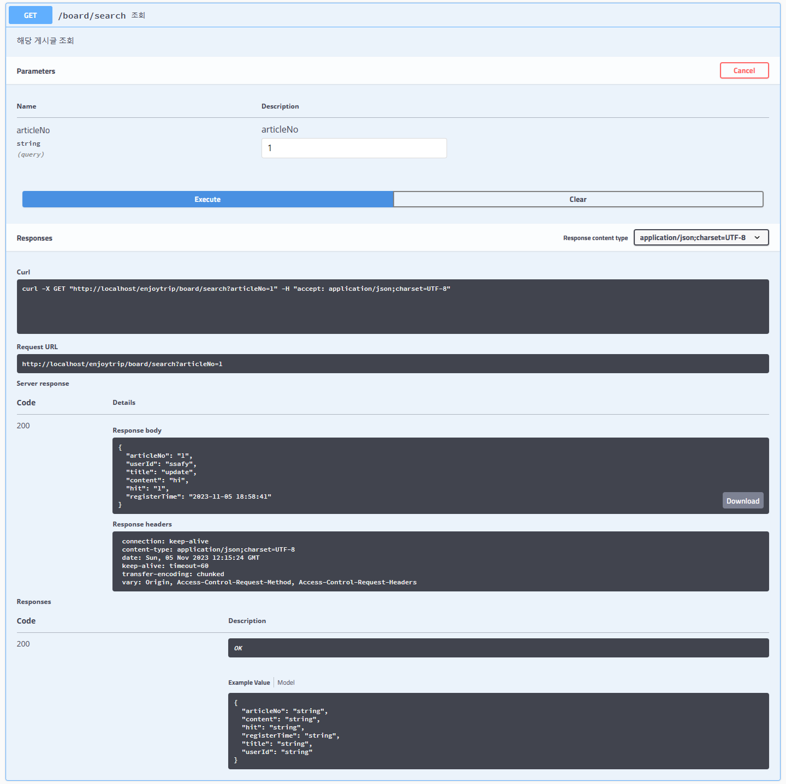
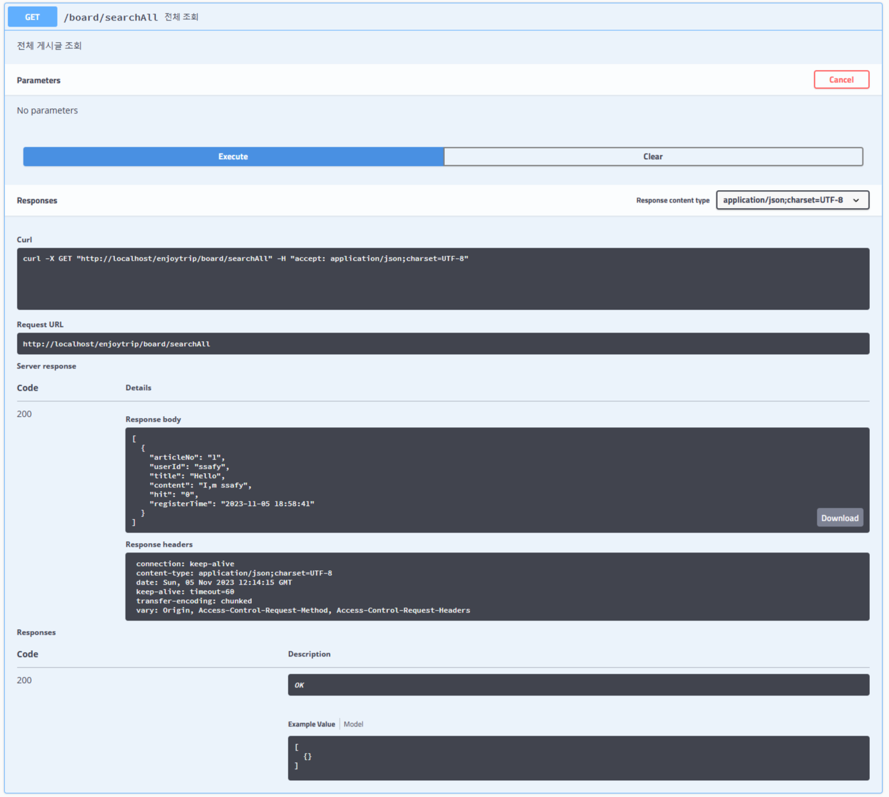
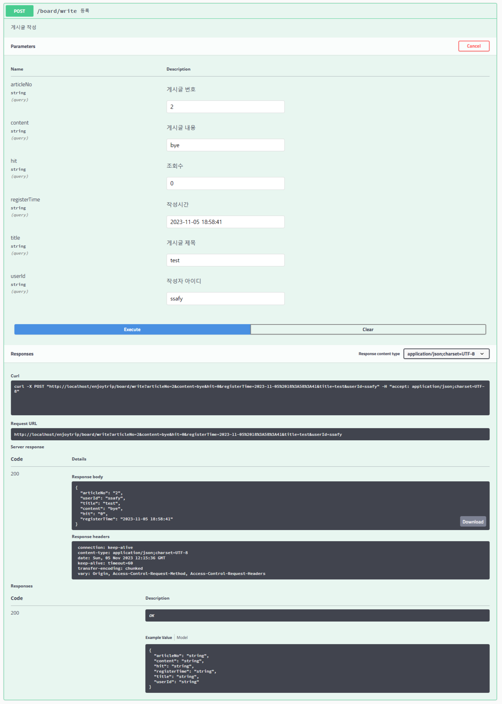

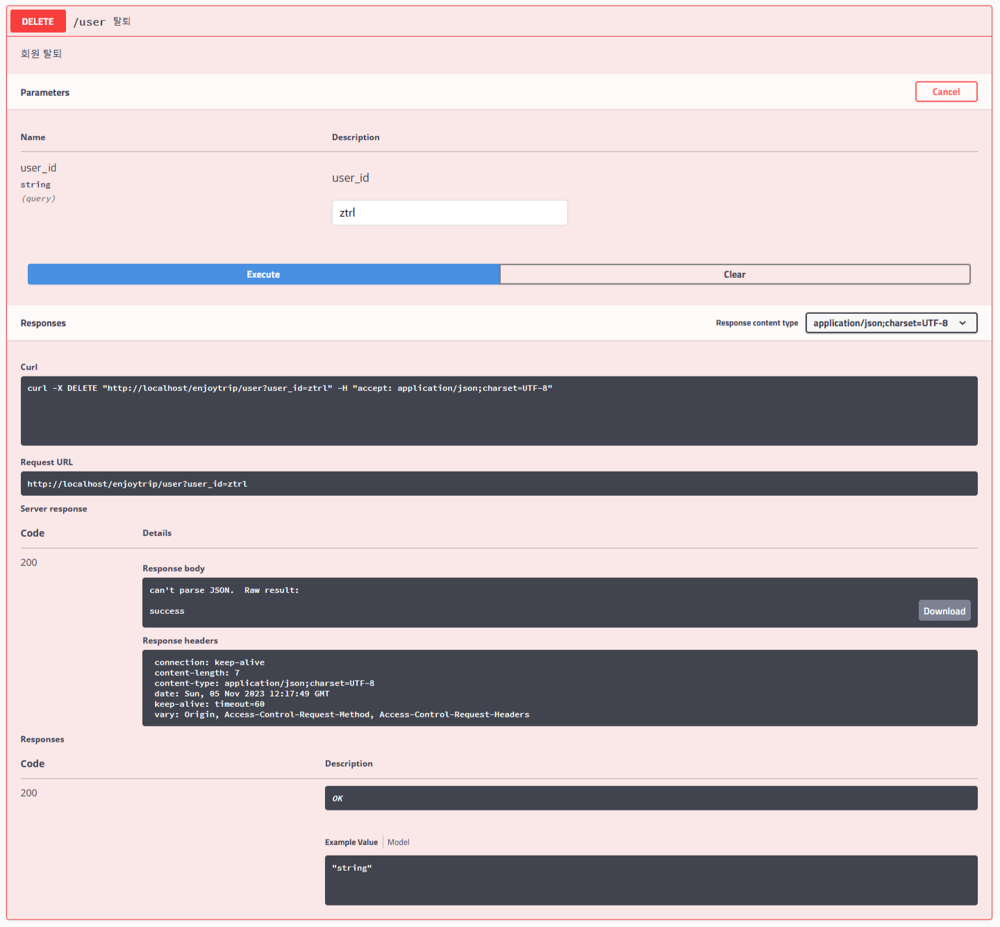
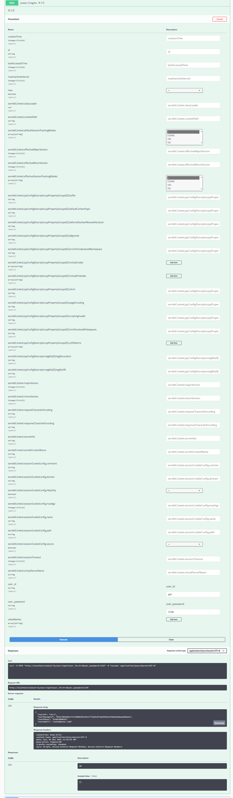
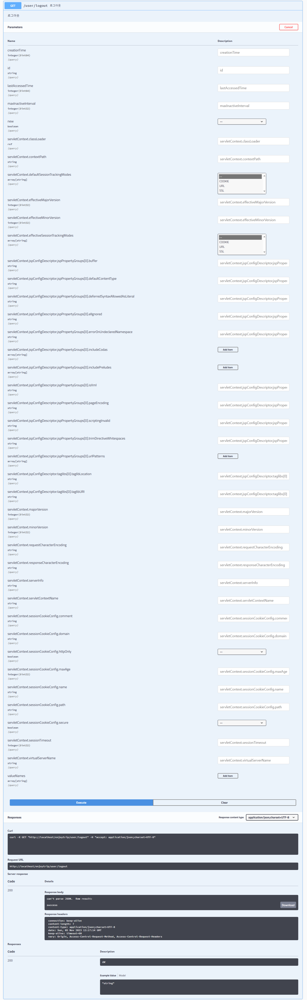
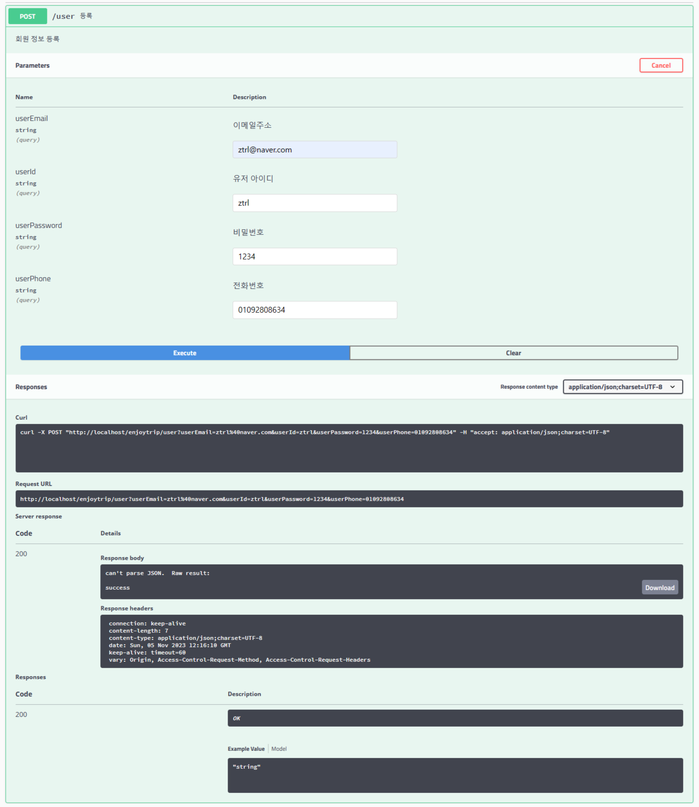
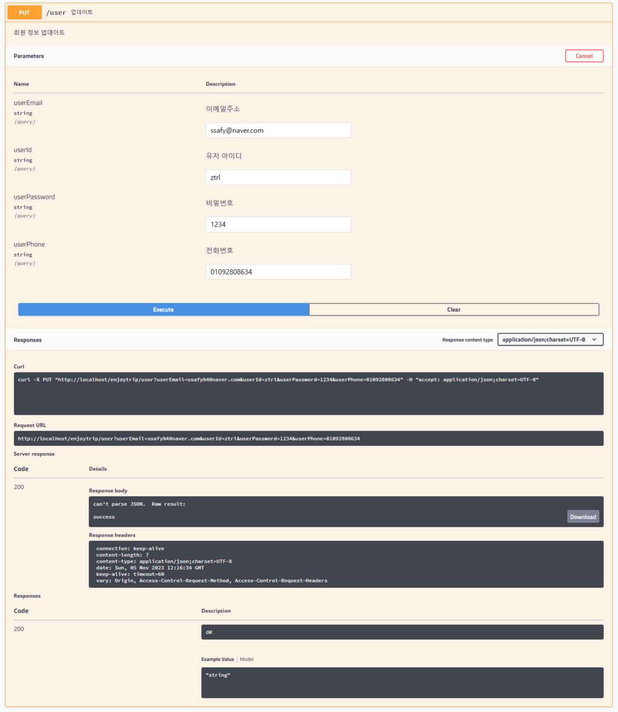
